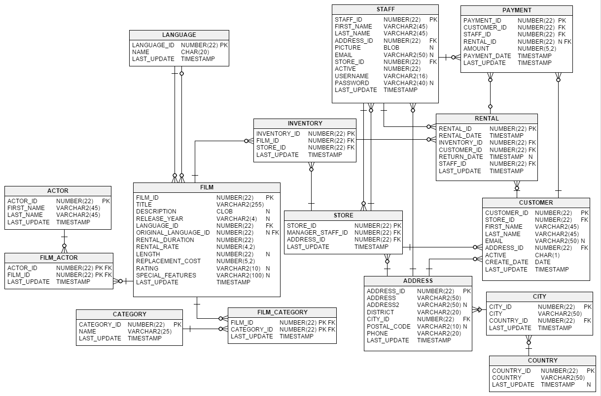
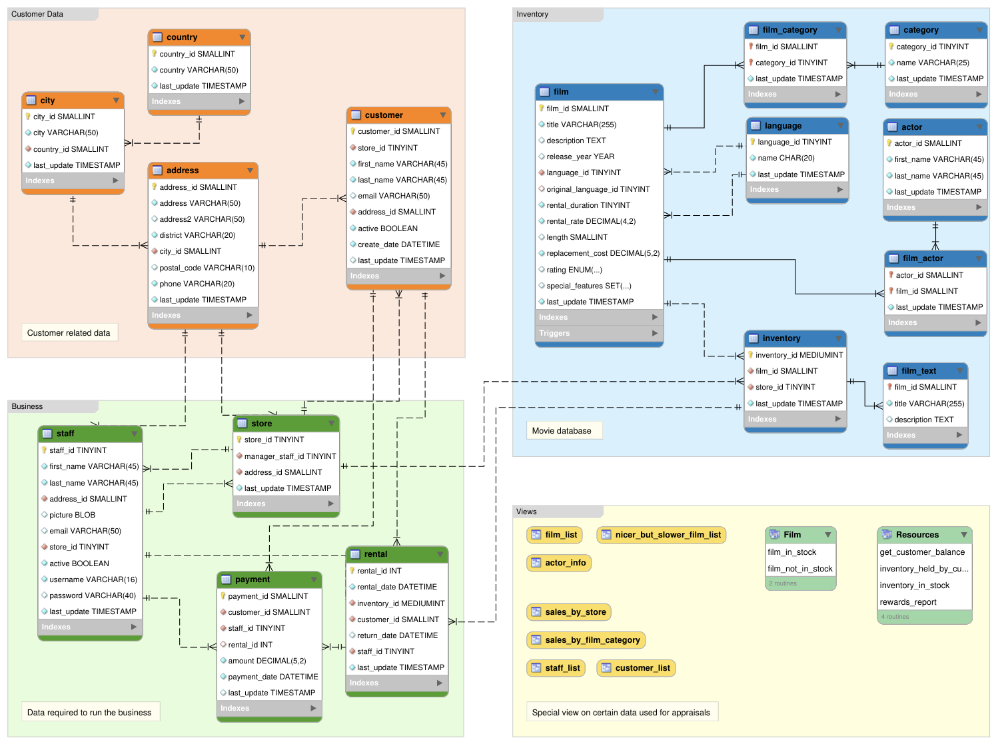

# The Sakila Database

One of the best example databases out there is the [Sakila Database](https://dev.mysql.com/doc/sakila/en/), which was originally created by MySQL and has been open sourced under the terms of the [BSD License](https://opensource.org/licenses/bsd-license.php).

The Sakila database is a nicely normalised schema modelling a DVD rental store, featuring things like films, actors, film-actor relationships, and a central inventory table that connects films, stores, and rentals.

## Two views of the schema



`sakila.png` emphasizes the core foreign-key relationships among films, inventory, rentals,
customers, staff, and payments.



`sakila_structure.png` groups the schema into customer data, inventory, business operations, and
reporting views. The diagrams explain the domain; executable demos always inspect the actual local
SQLite schema in `data/sakila.db`.

## Revenue path used by the demos

The Baseline and Levels 1–3 follow one explicit evidence chain:

```text
category → film_category → inventory → rental → payment
```

The chain connects a film category to physical inventory copies, completed rentals, and their
payments. The reference query groups by `category.name` and sums `payment.amount`.


As the connection lines show, each table is related to at least one other table in the database (with the exception of the `film_text` table). Some tables have two foreign keys that relate to the same table. For example the `film` table has two foreign keys that relate to the `language` table, namely `fk_film_language_original` and `fk_film_language`. Where more than one relationship exists between two tables, the connection lines run concurrently.

Identifying and non-identifying relationships are indicated by solid and broken lines respectively. For example, the foreign key `category_id` is part of the primary key in the `film_category` table so its relationship to the `category` table is drawn with a solid line. On the other hand, in the `city` table, the foreign key, `country_id`, is not part of the primary key so the connection uses a broken line.
